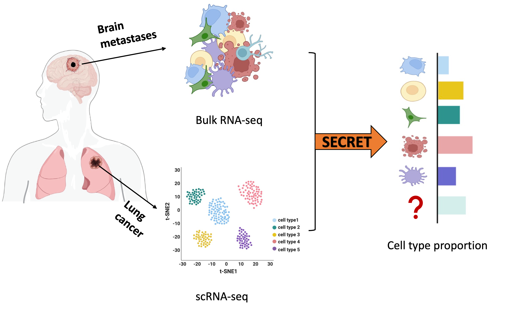

# SECRET
## Semi-reference based cell type deconvolution

**SECRET**, a reference-based approach, leverages the cell type-specific gene expression profiles obtained from single-cell RNA-Seq to effectively estimate cell type proportions in bulk data, particularly in instances where the bulk data contains cell types that are not present in the reference dataset.


## Installation

### Dependencies
- R version >= 4.0.0.
- R packages: Biobase, tidyverse, NOISeq, alabama

```{r}
# install devtools if necessary
install.packages('devtools')

# install the SECRED package
devtools::install_github('anlingUA/SECRET')

# load
library(SECRET)
```

- For an example how to use [SECRET](https://anlingUA.github.io/SECRET/vignettes/Intro_to_SECRET.html)
- Example datasets are in **vignettes** folder
